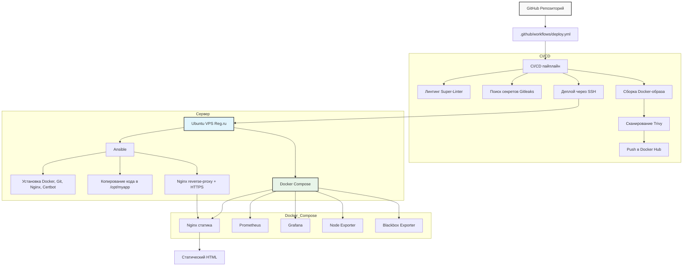

# DevOps проект

Продакшен-готовое решение для веб-приложения с полным циклом CI/CD, IaC, мониторингом и безопасностью.

---

## Обзор

Проект демонстрирует полный DevOps-жизненный цикл статического веб-приложения. Реализованы:

- инфраструктура как код (Terraform)
- управление конфигурацией (Ansible)
- CI/CD-пайплайн с проверками безопасности (GitHub Actions)
- контейнеризация (Docker, Docker Compose)
- мониторинг и наблюдаемость (Prometheus, Grafana)
- автоматический HTTPS (Let's Encrypt)
- сканирование уязвимостей контейнеров (Trivy)
- поиск секретов в коде (Gitleaks)
- проверка качества кода (Super-Linter, CodeQL)

Всё спроектировано так, чтобы быть воспроизводимым, поддерживаемым и готовым к реальной эксплуатации.

---

## Архитектура


### Путь трафика
Пользователь → HTTPS (443) → Nginx (хост) → proxy_pass → localhost:8080 → Nginx (контейнер) → статический HTML

---

## Технологии

| Область | Инструменты |
| :--- | :--- |
| CI/CD | GitHub Actions |
| Контейнеризация | Docker, Docker Compose |
| Управление конфигурацией | Ansible |
| Инфраструктура как код | Terraform (управление DNS) |
| Реверс-прокси | Nginx |
| HTTPS | Let's Encrypt (Certbot) |
| Мониторинг | Prometheus, Grafana, Node Exporter, Blackbox Exporter |
| Сканирование безопасности | Trivy, Gitleaks, CodeQL, Super-Linter |
| Приложение | Статический HTML через Nginx |


---

## CI/CD пайплайн

Пайплайн запускается при пуше в ветку `master`.

| Этап | Инструмент | Действие |
| :--- | :--- | :--- |
| **Линтинг** | Super-Linter | Проверка стиля и синтаксиса кода |
| **Поиск секретов** | Gitleaks | Обнаружение учётных данных в истории коммитов |
| **Сборка** | docker/build-push-action | Сборка Docker-образа с тегом `test` |
| **Безопасность** | Trivy | Сканирование критических уязвимостей в образе |
| **Пуш** | docker/build-push-action | Пуш образа с тегами `latest` и `${{ github.sha }}` |
| **Деплой** | Ansible (через SSH) | Копирование кода, настройка сервера, перезапуск контейнеров |
| **Smoke-тест** | curl | Проверка доступности сайта по HTTPS |

---

## Что делает плейбук Ansible

1. Обновляет APT-кеш и устанавливает Git, Nginx, Certbot.
2. Устанавливает Docker (официальный скрипт) и плагин Docker Compose.
3. Копирует код приложения в `/opt/myapp`.
4. Перезапускает контейнеры со свежими образами через `docker compose down && pull && up -d --force-recreate`.
5. Настраивает Nginx как реверс-прокси с редиректом HTTP → HTTPS и терминацией SSL.
6. Получает сертификат Let's Encrypt (если он ещё не существует).

---

## Стек мониторинга

Все сервисы мониторинга запускаются внутри Docker Compose.

| Сервис | Порт (хост) | Назначение |
| :--- | :--- | :--- |
| Приложение | 8080:80 | Статический HTML-сайт |
| Node Exporter | (внутренний) | Метрики хост-системы (CPU, RAM, диск) |
| Blackbox Exporter | (внутренний) | Проверка доступности HTTP/HTTPS |
| Prometheus | 9090:9090 | Сбор и хранение метрик |
| Grafana | 3000:3000 | Визуализация дашбордов (логин: admin/admin) |

---

## Меры безопасности

- HTTPS с автоматическим обновлением сертификатов (Let's Encrypt).
- Сканирование образов на критические уязвимости (Trivy).
- Обнаружение секретов в коде и истории коммитов (Gitleaks).
- Проверка качества и безопасности кода (Super-Linter, CodeQL).
- Nginx работает от непривилегированного пользователя внутри контейнера.
- Настроены healthcheck для всех контейнерных сервисов.

---

## Быстрый старт

### 1. Клонирование репозитория

```bash
git clone https://github.com/Egorict/DevopsProject.git
cd DevopsProject

2. Настройка секретов GitHub Actions
Создайте следующие секреты в настройках репозитория (Settings → Secrets and variables → Actions):

Секрет	              Описание
DOCKER_USERNAME	      Имя пользователя Docker Hub
DOCKER_TOKEN	      Токен доступа Docker Hub (Read & Write)
SERVER_HOST           Публичный IP VPS
SERVER_USER           Имя пользователя SSH (например, root)
SSH_PRIVATE_KEY	      Приватный SSH-ключ для доступа к серверу

3. Настройка Terraform (DNS)
Обновите terraform/terraform.tfvars с учётными данными Рег.ру:
username = "ваш-логин-рег.ру"
password = "ваш-альтернативный-пароль-api"

Затем примените:
cd terraform
terraform init
terraform apply

4. Запуск деплоя
git push origin master


Пайплайн выполнит:

Проверку кода.
Сборку и сканирование образа.
Деплой приложения на VPS.
Настройку HTTPS и мониторинга.


Реальные сценарии, решаемые проектом:

Ошибки ручного деплоя: пайплайн заменяет ручные шаги на автоматизированные, воспроизводимые процессы.
Отсутствие видимости: Prometheus и Grafana обеспечивают прозрачность состояния приложения и системы.
Дрейф конфигурации: Ansible гарантирует, что сервер соответствует заданному состоянию.
Уязвимости безопасности: Trivy и Gitleaks находят проблемы до того, как они попадают в продакшен.
Медленное восстановление: инфраструктура может быть полностью пересобрана из кода за минуты.